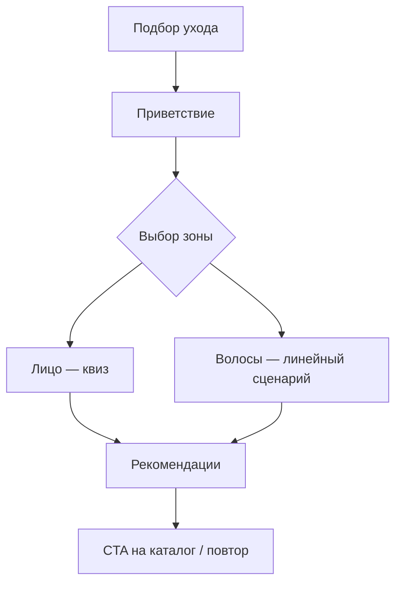
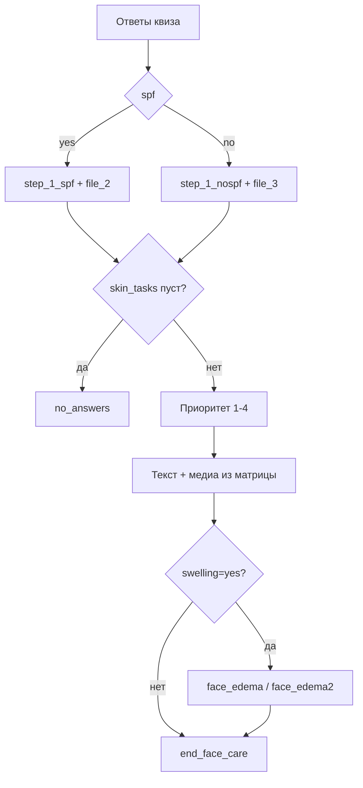

# Miraflores — спецификация веб-версии «Подбор ухода»

Документ описывает **единственный пользовательский сценарий** для реализации на сайте: интерактивный подбор ухода за лицом и волосами.

**Не входит в scope:** рассылки, админка, промокоды, Google Sheets, Telegram-интеграции, CRM-сегментация.

---

## 1. Назначение

Пользователь проходит короткий квиз и получает персонализированные рекомендации по уходу с текстами и медиа (изображения, видео, PDF).

**Бизнес-цель:** консультационный опыт бренда Miraflores → переход к покупке продуктов на сайте.

---

## 2. Точка входа

**Экран:** лендинг или раздел «Подобрать уход».

**Действие:** пользователь нажимает «Начать» / «Подобрать уход».

**Контент:**
- Приветственный текст (`greeting`)
- Два варианта зоны: **Лицо** | **Волосы**



---

## 3. Контент (CMS, не Google Sheets)

Все тексты и медиа хранятся в **CMS сайта** или JSON-конфиге. Ключи ниже — идентификаторы для разработки и контент-менеджеров.

### 3.1. Тексты

| key | Назначение |
|-----|------------|
| `greeting` | Приветствие на старте |
| `choose_care` | Подзаголовок перед выбором зоны |
| `hair_cleansing` | Волосы: блок 1 |
| `hair_care` | Волосы: блок 2 |
| `menu_face_hello` | Лицо: вступление к квизу |
| `face_q_age` | Вопрос о возрасте |
| `face_q_spf` | Вопрос об SPF |
| `face_q_skin` | Проблемы кожи |
| `face_q_skin2` | Задачи ухода |
| `face_q_edema` | Отёчность |
| `face_selfi` | Загрузка фото (опционально) |
| `face_steps` | Переход к рекомендациям |
| `face_study` | «Изучаем ваши ответы» |
| `step_1_spf` | Рекомендация шаг 1, если SPF = Да |
| `step_1_nospf` | Рекомендация шаг 1, если SPF = Нет |
| `no_answers` | Не выбраны задачи ухода |
| `other_steps_1` … `other_steps_8_2` | Рекомендации по приоритетам |
| `face_edema` | Доп. блок при отёчности (вариант 1) |
| `face_edema2` | Доп. блок при отёчности (вариант 2) |
| `end_face_care` | Завершение квиза |

Формат: Markdown или rich text в CMS.

### 3.2. Медиа

| key | Сценарий |
|-----|----------|
| `file_1`, `file_1.1` | Волосы |
| `file_2` | Лицо: шаг 1, SPF = Да |
| `file_3` | Лицо: шаг 1, SPF = Нет |
| `file_4`, `file_4.1` | Молодая кожа, приоритет 1 |
| `file_5`, `file_5.1` | Молодая кожа, приоритет 2 |
| `file_6`, `file_6.1` | Молодая кожа, приоритет 3 |
| `file_7`, `file_7.1` | Молодая кожа, приоритет 4 |
| `file_8` | Взрослая кожа, приоритет 1 |
| `file_9`, `file_9.1` | Взрослая кожа, приоритет 2 |
| `file_10`, `file_10.1` | Взрослая кожа, приоритет 3 |
| `file_11`, `file_12` | Взрослая кожа, приоритет 4 |

На сайте: URL в CDN (изображение, видео, PDF), не Telegram `file_id`.

---

## 4. Сценарий «Волосы»

Линейный флоу без ветвлений.

| Шаг | UI | Контент |
|-----|-----|---------|
| 1 | Текстовый блок | `hair_cleansing` |
| 2 | Текст + кнопка «Назад» / «Другая зона» | `hair_care` |
| 3 | Пауза ~3 с (loader / анимация) | — |
| 4 | Медиа | `file_1` |
| 5 | Медиа | `file_1.1` |

**Аналитика (опционально):** `hair_care_completed`.

---

## 5. Сценарий «Лицо» — квиз

Многошаговая форма. Состояние хранится в **сессии** (React state / `sessionStorage` / URL `/quiz/face/step-N`).

### 5.1. Шаг 1 — Возраст

**Текст:** `face_q_age`

| Ответ (кнопка/radio) | Внутреннее значение `skin_age` |
|----------------------|-------------------------------|
| моложе 25 | `young` |
| 25-40 | `young` |
| 40-50 | `mature` |
| 50+ | `mature` |

Невалидный ввод невозможен (только выбор из списка).

---

### 5.2. Шаг 2 — SPF

**Текст:** `face_q_spf`

| Ответ | Поле `spf` |
|-------|------------|
| Да | `yes` |
| Нет | `no` |

---

### 5.3. Шаг 3 — Проблемы кожи

**Текст:** `face_q_skin`  
**Тип:** мультивыбор (чекбоксы) + кнопки «Готово» и «Сбросить выбор».

| option_id | Текст на UI |
|-----------|-------------|
| `comedones` | Комедоны и воспаления |
| `blackheads` | Черные точки |
| `clear_skin` | Нет, у меня чистая кожа |

- «Сбросить выбор» → очистить `skin_issues[]`
- «Готово» без выбора → ошибка, остаться на шаге

---

### 5.4. Шаг 4 — Задачи ухода

**Текст:** `face_q_skin2`  
**Тип:** мультивыбор + «Готово» / «Сбросить выбор».

| option_id | Текст на UI |
|-----------|-------------|
| `sensitivity` | Высокая чувствительность |
| `dryness` | Сухость, чувство стянутости после умывания |
| `wrinkles` | Морщинки и возрастные изменения |
| `post_acne` | Следы постакне, пигментные пятна |
| `dark_circles` | Синяки под глазами |
| `good_skin` | У меня достаточно хорошая кожа, хочу качественные составы |

Минимум один выбор для перехода дальше.

---

### 5.5. Шаг 5 — Отёчность

**Текст:** `face_q_edema`

| Ответ | Поле `swelling` |
|-------|-----------------|
| Да | `yes` |
| Нет | `no` |

---

### 5.6. Шаг 6 — Фото (опционально)

**Текст:** `face_selfi`

- Загрузка 0–3 изображений (`accept="image/*"`)
- Кнопка «Далее» — продолжить с любым числом фото (0–3)

**На сайте:** фото можно сохранять для аналитики/CRM или не отправлять на сервер (только UX). Алгоритм рекомендаций **не использует** содержимое фото.

Подсказки при загрузке (как в боте):
- 1 фото: «Можно добавить ещё 2»
- 2 фото: «Можно добавить ещё 1»
- 3 фото: «Максимум достигнут»

---

### 5.7. Шаг 7 — Результат (генерация рекомендаций)

После «Далее» на шаге фото — экран результата с поэтапной подачей контента.

#### Модель ответов квиза (JSON)

```json
{
  "skin_age": "young",
  "spf": "yes",
  "skin_issues": ["comedones", "blackheads"],
  "skin_tasks": ["sensitivity", "dryness"],
  "swelling": "no",
  "selfie_count": 0
}
```

#### Последовательность показа

| # | Контент | Задержка (UX) |
|---|---------|---------------|
| 1 | `face_steps` | — |
| 2 | `face_study` | ~3 с loader |
| 3 | Шаг 1 (SPF) + медиа | ~3 с между блоками |
| 4 | Шаг 2+ (приоритет) + медиа | ~3–5 с |
| 5 | Отёчность (если `swelling=yes`) | ~5 с |
| 6 | `end_face_care` + CTA | — |

#### Шаг 1 — зависит от SPF

| `spf` | Текст | Медиа |
|-------|-------|-------|
| `yes` | `step_1_spf` | `file_2` |
| `no` | `step_1_nospf` | `file_3` |

---

## 6. Движок рекомендаций (ядро логики)

### 6.1. Группы приоритетов

Проверяются **сверху вниз**. Берётся **первая** группа, в которой есть хотя бы одна выбранная задача из `skin_tasks`.

| Приоритет | `skin_tasks` (option_id) |
|-----------|--------------------------|
| 1 | `sensitivity`, `dryness` |
| 2 | `post_acne` |
| 3 | `dark_circles` |
| 4 | `wrinkles`, `good_skin` |

Если `skin_tasks` пуст → показать `no_answers`.

### 6.2. Матрица контента

| `skin_age` | Приоритет | Текст | Медиа | Если `swelling=yes` |
|------------|-----------|-------|-------|---------------------|
| `young` | 1 | `other_steps_1` | file_4, file_4.1 | + `face_edema` |
| `young` | 2 | `other_steps_2` | file_5, file_5.1 | + `face_edema2` |
| `young` | 3 | `other_steps_3` | file_6, file_6.1 | + `face_edema2` |
| `young` | 4 | `other_steps_4` | file_7, file_7.1 | + `face_edema2` |
| `mature` | 1 | `other_steps_5` | file_8 | + `face_edema` |
| `mature` | 2 | `other_steps_6` | file_9, file_9.1 | + `face_edema2` |
| `mature` | 3 | `other_steps_7` | file_10, file_10.1 | + `face_edema2` |
| `mature` | 4 | `other_steps_8_1` + `other_steps_8_2` | file_11, file_12 | + `face_edema2` |

Приоритет 4 для `mature`: два текстовых блока подряд, затем два медиа.

### 6.3. Псевдокод

```typescript
type SkinAge = 'young' | 'mature';
type Spf = 'yes' | 'no';
type Swelling = 'yes' | 'no';

const PRIORITIES: string[][] = [
  ['sensitivity', 'dryness'],
  ['post_acne'],
  ['dark_circles'],
  ['wrinkles', 'good_skin'],
];

function getPriorityIndex(skinTasks: string[]): number | null {
  for (let i = 0; i < PRIORITIES.length; i++) {
    if (PRIORITIES[i].some(t => skinTasks.includes(t))) return i + 1;
  }
  return null;
}

function buildFaceResult(answers: QuizAnswers): ContentBlock[] {
  const blocks: ContentBlock[] = [];

  // Шаг 1 — SPF
  blocks.push(
  answers.spf === 'yes'
    ? { text: 'step_1_spf', media: ['file_2'] }
    : { text: 'step_1_nospf', media: ['file_3'] }
  );

  const priority = getPriorityIndex(answers.skin_tasks);
  if (!priority) {
    blocks.push({ text: 'no_answers' });
    return blocks;
  }

  // Шаг 2+ — из матрицы (см. §6.2)
  blocks.push(...getRecommendationBlocks(answers.skin_age, priority));

  if (answers.swelling === 'yes') {
    blocks.push({
      text: priority === 1 && answers.skin_age === 'young' ? 'face_edema' : 'face_edema2'
    });
  }

  blocks.push({ text: 'end_face_care' });
  return blocks;
}
```



---

## 7. UI/UX для веба

| Элемент бота | Реализация на сайте |
|--------------|---------------------|
| Reply-кнопки | Radio / chip / card selection |
| Мультивыбор | Чекбоксы + «Готово» |
| Прогресс квиза | Stepper: «Шаг 2 из 6» |
| Задержки 3/10 с | Skeleton / progress bar / «Подбираем уход…» |
| Медиа | ``, `<video>`, ссылка на PDF |
| Markdown | Rich text renderer |
| «Назад в меню» | «Выбрать другую зону» / «Начать заново» |

### Рекомендуемая структура URL

```
/quiz                    — выбор зоны
/quiz/hair               — сценарий волос
/quiz/face               — шаг 1 (возраст)
/quiz/face/spf
/quiz/face/issues
/quiz/face/tasks
/quiz/face/swelling
/quiz/face/photo
/quiz/face/result        — рекомендации
```

---

## 8. API (минимальный backend)

Backend опционален: квиз можно полностью считать на клиенте. Если нужна аналитика:

```
POST /api/quiz/face/complete
Body: { answers, result_priority, session_id }
→ 200 OK

GET  /api/content/:key
→ { text, media[] }   // или всё из CMS на build-time
```

**Не нужны:** пользователи, рассылки, сегменты, Google Sheets sync.

---

## 9. Аналитика (опционально)

| Событие | Когда |
|---------|-------|
| `quiz_started` | Открыт подбор ухода |
| `zone_selected` | `face` / `hair` |
| `face_step_completed` | Каждый шаг квиза |
| `face_quiz_completed` | Показан результат |
| `result_cta_clicked` | Клик «В каталог» / «Купить» |

Поля: `skin_age`, `priority`, `spf`, `swelling` — для продуктовой аналитики.

---

## 10. Финальный экран и CTA

После `end_face_care` / завершения волос:

- Кнопка **«Перейти в каталог»** (ссылка на релевантную категорию)
- Кнопка **«Пройти заново»**
- Опционально: блок «Рекомендуемые товары» — привязка SKU к `priority` + `skin_age` в CMS (вне scope текущего бота, но логичное расширение для сайта)

---

## 11. Чеклист MVP

- [ ] Экран выбора зоны (Лицо / Волосы)
- [ ] Линейный флоу «Волосы» (2 текста + 2 медиа)
- [ ] Квиз «Лицо» — 6 шагов + валидация
- [ ] Движок приоритетов (§6) — unit-тесты на все 8 комбинаций age × priority
- [ ] Экран результата с поэтапной анимацией
- [ ] CMS / JSON для всех ключей текстов и медиа
- [ ] Адаптив (mobile-first)
- [ ] CTA на каталог

---

## 12. Вне scope (явно не делаем)

- Рассылки и кампании
- Админ-панель рассылок
- Согласование ЛПР
- Промокод и проверка подписки на Telegram-канал
- Google Sheets как источник данных
- Telegram-бот как канал доставки
- Хранение профилей пользователей в таблицах

---

*Спецификация для веб-версии. Источник логики: `bot.py` (сценарии «Лицо» и «Волосы»).*
